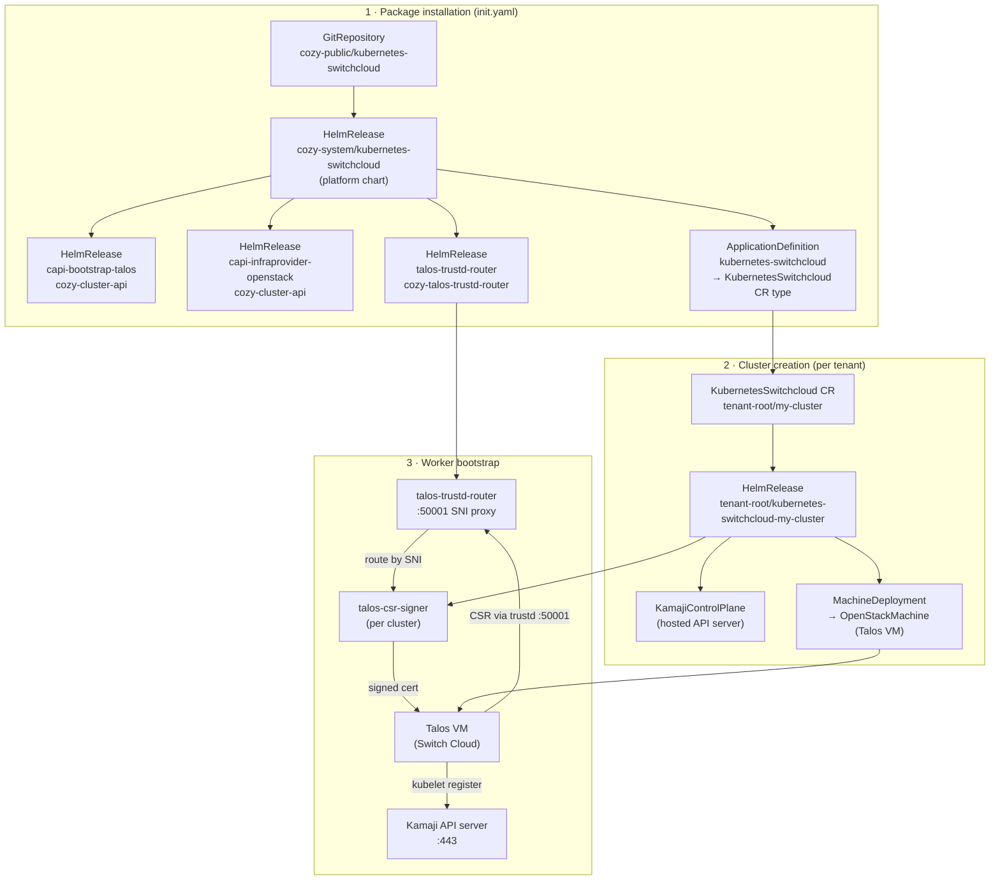

# kubernetes-switchcloud

Cozystack package for managed Kubernetes clusters on [Switch Cloud](https://cloud.switch.ch)
(OpenStack + Talos Linux worker nodes via Cluster API).

## How it works



**Cluster naming:** a `KubernetesSwitchcloud` CR named `my-cluster` in namespace `tenant-root`
creates a `HelmRelease` named `kubernetes-switchcloud-my-cluster` and all associated CAPI
objects. The Kamaji API endpoint becomes
`kubernetes-switchcloud-my-cluster.<namespace>.svc` / `kubernetes-switchcloud-my-cluster.<domain>`.

## Prerequisites

- Cozystack management cluster with these packages enabled:

  | Package | Purpose |
  | --- | --- |
  | `cozystack.capi-operator` | Cluster API operator |
  | `cozystack.capi-provider-core` | CAPI core controllers |
  | `cozystack.capi-provider-cp-kamaji` | Kamaji hosted control-plane provider |
  | `cozystack.kamaji` | Kamaji operator |

- A Switch Cloud project with **Application Credentials** (Identity → Application Credentials in
  the Switch Cloud portal). The credentials need Compute, Network, and Image permissions.

- A Glance image with Talos Linux. Build it at
  [factory.talos.dev](https://factory.talos.dev/) selecting the `openstack` platform, then
  upload to your Switch Cloud project. The default `imageName` value in the chart is
  `talos-openstack-amd64`.

## Installation

Apply `init.yaml` once on the management cluster. This registers a `GitRepository` pointing to
this repo and a `HelmRelease` that installs the platform chart, which in turn deploys the CAPI
providers for Talos bootstrapping and OpenStack infrastructure, the `talos-trustd-router` SNI
proxy (required for Talos worker certificate signing), and the `ApplicationDefinition` that
makes `KubernetesSwitchcloud` available as a resource type in the Cozystack API and dashboard.

```bash
kubectl apply --filename \
  https://raw.githubusercontent.com/aenix-org/kubernetes-switchcloud/main/init.yaml
```

For GitOps (recommended), commit `init.yaml` into your Flux repository alongside other
cluster-level manifests and let Flux apply it.

### Verify

```bash
kubectl get helmreleases --namespace cozy-cluster-api
# capi-bootstrap-talos          True
# capi-infraprovider-openstack  True

kubectl get helmreleases --namespace cozy-talos-trustd-router
# talos-trustd-router           True

kubectl get applicationdefinition kubernetes-switchcloud
# kubernetes-switchcloud        ...
```

Once `ApplicationDefinition` is ready, the `KubernetesSwitchcloud` resource type is available
in the Cozystack dashboard under **IaaS**.

## Creating a cluster

Create a `KubernetesSwitchcloud` resource in any tenant namespace:

```yaml
apiVersion: apps.cozystack.io/v1alpha1
kind: KubernetesSwitchcloud
metadata:
  name: my-cluster
  namespace: tenant-myproject
spec:
  version: v1.32.6
  talosVersion: v1.10.0
  controlPlane:
    replicas: 2
  openstack:
    authURL: https://identity.api.zhw.cloud.switch.ch/v3
    regionName: zhw
    existingSecret: my-cluster-openstack   # see "Credentials" below
    network:
      id: "<openstack-network-uuid>"
    floatingIPNetwork: ""                  # leave empty — SNAT provides outbound internet
  nodeGroups:
    md0:
      flavorName: c004r008
      imageName: "Talos v1.13.0 openstack amd64"
      minReplicas: 1
      maxReplicas: 5
      resources:
        cpu: 4
        memory: 8Gi
  addons:
    certManager:
      enabled: true
    metricsServer:
      enabled: true
    providerIdSetter:
      enabled: true
```

Apply it:

```bash
kubectl apply --filename my-cluster.yaml
```

Watch progress:

```bash
# HelmRelease for the cluster itself
kubectl get helmrelease kubernetes-switchcloud-my-cluster --namespace tenant-myproject --watch

# CAPI Machine provisioning
kubectl get machines --namespace tenant-myproject --watch
```

### Getting the kubeconfig

```bash
kubectl get secret kubernetes-switchcloud-my-cluster-admin-kubeconfig \
  --namespace tenant-myproject \
  --output jsonpath='{.data.admin\.conf}' \
  | base64 --decode > my-cluster.yaml

kubectl --kubeconfig my-cluster.yaml get nodes
```

## Credentials

### Existing Secret (recommended)

Create a `clouds.yaml` Secret in the same namespace as the cluster:

```bash
kubectl create secret generic my-cluster-openstack \
  --namespace tenant-myproject \
  --from-literal=clouds.yaml='
clouds:
  openstack:
    auth:
      auth_url: https://identity.api.zhw.cloud.switch.ch/v3
      application_credential_id: "<id>"
      application_credential_secret: "<secret>"
    region_name: zhw
'
```

Reference it in the spec:

```yaml
spec:
  openstack:
    existingSecret: my-cluster-openstack
    cloudName: openstack
```

### Inline credentials (simple / testing)

```yaml
spec:
  openstack:
    applicationCredentialID: "<id>"
    applicationCredentialSecret: "<secret>"
```

## Addons

| Addon | Default | Notes |
| --- | --- | --- |
| `addons.cilium` | always on | CNI — required |
| `addons.certManager.enabled` | `true` | cert-manager |
| `addons.metricsServer.enabled` | `true` | HPA/VPA support |
| `addons.providerIdSetter.enabled` | `false` | Required for Cluster Autoscaler |
| `addons.clusterAutoscaler.enabled` | `false` | CAPI-based autoscaler |
| `addons.ingressNginx.enabled` | `false` | ingress-nginx |
| `addons.fluxcd.enabled` | `false` | FluxCD inside the tenant cluster |
| `addons.openstackCCM.enabled` | `false` | OpenStack Cloud Controller Manager |
| `addons.trustd.enabled` | `false` | talos-csr-signer (needed for `talosctl` on workers) |

## Cluster Autoscaler

Requires `addons.providerIdSetter.enabled: true` — the autoscaler maps nodes to cloud instances
via `spec.providerID`.

```yaml
addons:
  providerIdSetter:
    enabled: true
  clusterAutoscaler:
    enabled: true
    image: registry.k8s.io/autoscaling/cluster-autoscaler:v1.32.0  # match Kubernetes minor
    scaleDownDelayAfterAdd: 10m
    scaleDownUnneededTime: 10m
    maxNodeProvisionTime: 20m
```

Set `minReplicas: 0` on node groups to enable scale-to-zero.

## Repository layout

```text
charts/
  kubernetes-switchcloud/         Main application chart (CAPI cluster + addons)
  capi-bootstrap-talos/           CAPI Talos bootstrap provider
  capi-infraprovider-openstack/   CAPI OpenStack infrastructure provider
  talos-trustd-router/            SNI proxy — routes Talos trustd CSR requests per cluster
  talos-csr-signer/               Per-cluster Talos certificate signer
  provider-id-setter/             DaemonSet — sets spec.providerID from OpenStack IMDS
packages/core/platform/           Platform Helm chart (installed by init.yaml)
packages/apps/example-values.yaml Example cluster values
fip-reconciler/                   FIP reconciler source (workaround for CAPO shared-router)
init.yaml                         Bootstrap — apply once to register the package
```
