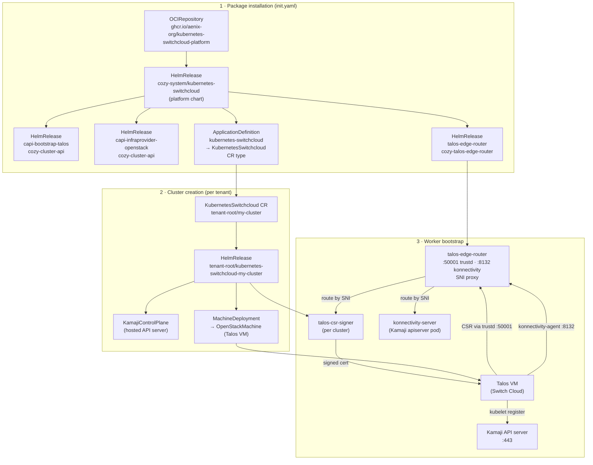

# kubernetes-switchcloud

Cozystack package for managed Kubernetes clusters on [Switch Cloud](https://cloud.switch.ch)
(OpenStack + Talos Linux worker nodes via Cluster API).

## How it works



**Cluster naming:** a `KubernetesSwitchcloud` CR named `my-cluster` in namespace `tenant-root`
creates a `HelmRelease` named `kubernetes-switchcloud-my-cluster` and all associated CAPI
objects. The Kamaji API endpoint becomes
`kubernetes-switchcloud-my-cluster.<namespace>.svc` / `kubernetes-switchcloud-my-cluster.<domain>`.

## Prerequisites

- Cozystack management cluster with these packages enabled:

  | Package | Purpose |
  | --- | --- |
  | `cozystack.capi-operator` | Cluster API operator |
  | `cozystack.capi-provider-core` | CAPI core controllers |
  | `cozystack.capi-provider-cp-kamaji` | Kamaji hosted control-plane provider |
  | `cozystack.kamaji` | Kamaji operator |

- A Switch Cloud project with **Application Credentials** (Identity → Application Credentials in
  the Switch Cloud portal). The credentials need Compute, Network, and Image permissions.

- A Glance image with Talos Linux. Build it at
  [factory.talos.dev](https://factory.talos.dev/) selecting the `openstack` platform, then
  upload to your Switch Cloud project. The default `imageName` value in the chart is
  `talos-openstack-amd64`.

## Installation

Apply `init.yaml` once on the management cluster. This creates an `OCIRepository` pointing to
the platform chart on GHCR and a `HelmRelease` that installs it. The platform chart deploys the
CAPI providers for Talos bootstrapping and OpenStack infrastructure, the `talos-edge-router`
SNI proxy (required for Talos worker certificate signing and konnectivity tunnelling), and the
`ApplicationDefinition` that makes `KubernetesSwitchcloud` available as a resource type in the
Cozystack API and dashboard.

```bash
kubectl apply --filename \
  https://raw.githubusercontent.com/aenix-org/kubernetes-switchcloud/main/init.yaml
```

For GitOps (recommended), commit `init.yaml` into your Flux repository alongside other
cluster-level manifests and let Flux apply it.

### Verify

```bash
kubectl get helmreleases --namespace cozy-cluster-api
# capi-bootstrap-talos          True
# capi-infraprovider-openstack  True

kubectl get helmreleases --namespace cozy-talos-edge-router
# talos-edge-router             True

kubectl get applicationdefinition kubernetes-switchcloud
# kubernetes-switchcloud        ...
```

Once `ApplicationDefinition` is ready, the `KubernetesSwitchcloud` resource type is available
in the Cozystack dashboard under **IaaS**.

## Creating a cluster

Create a `KubernetesSwitchcloud` resource in any tenant namespace:

```yaml
apiVersion: apps.cozystack.io/v1alpha1
kind: KubernetesSwitchcloud
metadata:
  name: my-cluster
  namespace: tenant-myproject
spec:
  version: v1.32.6
  talosVersion: v1.10.0
  controlPlane:
    replicas: 2
  # IngressClass that the Kamaji-managed apiserver Ingress is annotated
  # with. The default fallback is the parent tenant namespace name
  # (e.g. `tenant-root`), which only works if you actually run a
  # per-tenant Ingress controller by that name. On a stock Cozystack
  # the host-level controller is `nginx` and you almost certainly want
  # to point at it explicitly — otherwise the host ingress-nginx will
  # not pick the apiserver Ingress up and the bootstrap kubelet hits
  # the controller's fallback "ingress.local" certificate, fails the
  # TLS handshake against the apiserver, and the worker never joins.
  ingressClassName: nginx
  openstack:
    authURL: https://identity.api.zhw.cloud.switch.ch/v3
    regionName: zhw
    applicationCredentialID: "<id>"
    applicationCredentialSecret: "<secret>"
    network:
      # Auto-managed mode (recommended for new clusters):
      # leave id empty. CAPO will create a dedicated Neutron
      # network + subnet + router on cluster apply and tear them
      # down on cluster delete — per-cluster L2/L3 isolation in
      # the same OpenStack project comes for free.
      id: ""
      subnetCIDR: "10.244.0.0/24"           # IPv4 CIDR for the auto-managed subnet
      externalNetworkID: ""                 # leave empty to let CAPO auto-discover
    floatingIPNetwork: ""                  # leave empty — SNAT provides outbound internet
  nodeGroups:
    md0:
      flavorName: c004r008
      imageName: "Talos v1.13.0 openstack amd64"
      minReplicas: 1
      maxReplicas: 5
      resources:
        cpu: 4
        memory: 8Gi
  addons:
    certManager:
      enabled: true
    metricsServer:
      enabled: true
    providerIdSetter:
      enabled: true
```

Apply it:

```bash
kubectl apply --filename my-cluster.yaml
```

Watch progress:

```bash
# HelmRelease for the cluster itself
kubectl get helmrelease kubernetes-switchcloud-my-cluster --namespace tenant-myproject --watch

# CAPI Machine provisioning
kubectl get machines --namespace tenant-myproject --watch
```

### Getting the kubeconfig

```bash
kubectl get secret kubernetes-switchcloud-my-cluster-admin-kubeconfig \
  --namespace tenant-myproject \
  --output jsonpath='{.data.admin\.conf}' \
  | base64 --decode > my-cluster.yaml

kubectl --kubeconfig my-cluster.yaml get nodes
```

## Network modes

`spec.openstack.network` has two mutually exclusive modes; the
chart picks one based on whether `id` is set.

### Auto-managed (recommended for new clusters)

Leave `spec.openstack.network.id` empty. CAPO renders the
`OpenStackCluster` with `managedSubnets` + `managedSecurityGroups`
and creates per-cluster:

- Neutron network `<release>-cluster`
- IPv4 subnet from `spec.openstack.network.subnetCIDR` (default
  `10.244.0.0/24`)
- Router with external gateway on
  `spec.openstack.network.externalNetworkID` (auto-discovered if
  empty — works in Switch Cloud zhw where `public` is the single
  external network)
- Control + worker security groups with the Kubernetes baseline
  (kubelet, etcd, kube-apiserver, CNI, inter-node)

All four resources are owned by the `OpenStackCluster` CR and
deleted automatically when the `KubernetesSwitchcloud` CR is
removed. Different clusters in the same OpenStack project sit on
distinct networks — no shared ARP/broadcast domain, no implicit
cross-cluster routing.

IPv6 dual-stack is not yet supported in this mode (CAPO v0.12.x
`managedSubnets` is IPv4-only); track upstream.

### Legacy (pre-existing network)

Set `spec.openstack.network.id` to the UUID of an operator-provisioned
Neutron network. The chart skips `managedSubnets` and the workers
join L2 with whatever else lives in that network. Suitable for
shared org-wide networks (`Nuvolos`-style) or migration of
historical clusters. **`spec.openstack.network.id` is immutable
once set** — clearing it on a live cluster would silently switch
modes and trigger a full network re-provision; the schema enforces
this with a CEL rule.

## LoadBalancer Services

When the `loadbalancer-controller` is installed in the management
cluster, tenant Services of `type: LoadBalancer` are provisioned
end-to-end automatically. Opt in per cluster:

```yaml
spec:
  openstack:
    loadBalancer:
      enabled: true
      vipNetworkID: ""        # auto-discovered from OpenStackCluster.status.network.id
      floatingNetworkID: "<public-net-uuid>"
```

What the controller manages:

- Octavia LB (OVN provider, single `SOURCE_IP_PORT` algorithm —
  Switch Cloud zhw constraint), listeners, pool, members.
- Floating IP allocated from `floatingNetworkID`, bound to the
  LB's VIP port; the FIP address is published back to
  `Service.status.loadBalancer.ingress`.
- Per-cluster Neutron security group `cozystack-lb-<cluster>` with
  intra-SG baseline + per-Service NodePort ingress rules.
- SG attachment to worker ports and removal of the project
  `default` SG (full L4 isolation between clusters in the same
  project — distinct SGs across clusters mean allow-from-same-SG
  never crosses cluster boundaries).
- Cleanup on `Service` delete / type-change / cluster delete via
  finalizers + a periodic orphan sweeper.

If the operator wants to keep the `default` SG (SSH from a
jump host, monitoring scrapes), pin
`spec.openstack.loadBalancer.workerSecurityGroupID` to an
operator-owned SG and the controller will not touch port SG
attachments.

## Credentials

### Inline credentials (recommended)

Put the credentials directly in the CR spec. The chart creates a Secret in the
cluster namespace automatically — no manual secret management needed, and each
cluster can have its own credentials:

```yaml
spec:
  openstack:
    authURL: https://identity.api.zhw.cloud.switch.ch/v3
    regionName: zhw
    applicationCredentialID: "<id>"
    applicationCredentialSecret: "<secret>"
```

### Existing Secret (advanced)

If you prefer to manage the Secret outside the CR (e.g. via External Secrets
Operator), create a `clouds.yaml` Secret in the same namespace as the cluster:

```bash
kubectl create secret generic my-cluster-openstack \
  --namespace tenant-myproject \
  --from-literal=clouds.yaml='
clouds:
  openstack:
    auth:
      auth_url: https://identity.api.zhw.cloud.switch.ch/v3
      application_credential_id: "<id>"
      application_credential_secret: "<secret>"
    region_name: zhw
'
```

Then reference it:

```yaml
spec:
  openstack:
    existingSecret: my-cluster-openstack
    cloudName: openstack
```

## Addons

| Addon | Default | Notes |
| --- | --- | --- |
| `addons.cilium` | always on | CNI — required |
| `addons.certManager.enabled` | `true` | cert-manager |
| `addons.metricsServer.enabled` | `true` | HPA/VPA support |
| `addons.providerIdSetter.enabled` | `false` | Required for Cluster Autoscaler |
| `addons.clusterAutoscaler.enabled` | `false` | CAPI-based autoscaler |
| `addons.ingressNginx.enabled` | `false` | ingress-nginx |
| `addons.fluxcd.enabled` | `false` | FluxCD inside the tenant cluster |
| `addons.openstackCCM.enabled` | `false` | OpenStack Cloud Controller Manager |
| `addons.trustd.networkPolicy.allowCIDRs` | `[]` | Source CIDRs for talos-csr-signer (always enabled) |

## Cluster Autoscaler

Requires `addons.providerIdSetter.enabled: true` — the autoscaler maps nodes to cloud instances
via `spec.providerID`.

```yaml
addons:
  providerIdSetter:
    enabled: true
  clusterAutoscaler:
    enabled: true
    image: registry.k8s.io/autoscaling/cluster-autoscaler:v1.32.0  # match Kubernetes minor
    scaleDownDelayAfterAdd: 10m
    scaleDownUnneededTime: 10m
    maxNodeProvisionTime: 20m
```

Set `minReplicas: 0` on node groups to enable scale-to-zero.

## Repository layout

```text
packages/apps/
  kubernetes-switchcloud/         Main application chart (CAPI cluster + addons)
packages/system/
  capi-bootstrap-talos/           CAPI Talos bootstrap provider
  capi-infraprovider-openstack/   CAPI OpenStack infrastructure provider
  talos-edge-router/              SNI proxy — per-cluster routing for trustd CSR and konnectivity
  talos-csr-signer/               Per-cluster Talos certificate signer
  tenant-apiserver-proxy/         Per-node TLS SNI-injecting proxy for tenant apiserver routing
  provider-id-setter/             DaemonSet — sets spec.providerID from OpenStack IMDS
  loadbalancer-controller/        Centralised OpenStack LoadBalancer provisioner chart
  kilo/                           Kilo WireGuard mesh for tenant clusters
  kilo-clustermesh-operator/      ClusterMesh operator for cross-cluster Kilo peering
packages/core/platform/           Platform Helm chart (installed by init.yaml)
packages/apps/example-values.yaml Example cluster values
init.yaml                         Bootstrap — apply once to register the package
```
